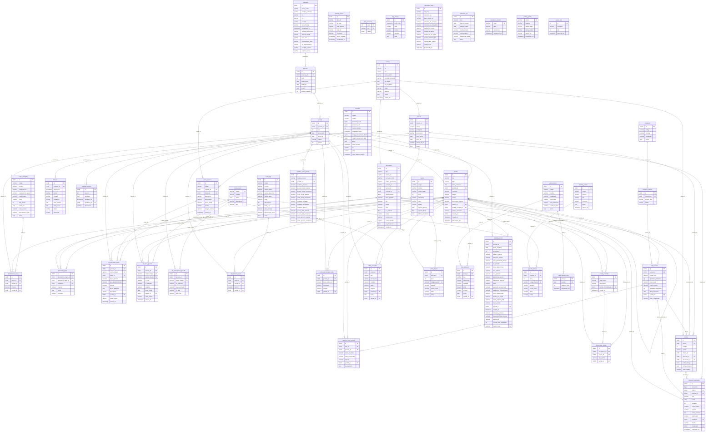

# Modelo de datos - Colibri

Generado desde PostgreSQL (127.0.0.1:5434/colibri).
Excluye `flyway_schema_history` (metadata de migraciones).

```mermaid
erDiagram
    activo_fijo {
        UUID id PK
        varchar codigo
        varchar nombre
        varchar cuenta_activo
        varchar cuenta_dep_acum
        varchar cuenta_gasto
        numeric costo
        int vida_meses
        date fecha_uso
        numeric valor_residual
        numeric depreciacion_acum
        bool activo
    }
    activo_intangible {
        UUID id PK
        varchar codigo
        varchar nombre
        varchar cuenta_activo
        varchar cuenta_amort_acum
        varchar cuenta_gasto
        numeric costo
        int vida_meses
        date fecha_uso
        numeric valor_residual
        numeric amortizacion_acum
        bool activo
    }
    amortizacion_cuota {
        UUID id PK
        UUID activo_id FK
        UUID periodo_id FK
        numeric importe
        UUID partida_id FK
    }
    aplicacion_pago {
        UUID id PK
        UUID documento_origen_id FK
        UUID documento_pago_id FK
        UUID partida_id FK
        numeric importe
        date fecha
        varchar concepto
    }
    bitacora {
        UUID id PK
        UUID contador_id FK
        timestamp fecha_hora
        varchar accion
        varchar entidad
        varchar entidad_id
        text valor_anterior
        text valor_nuevo
        varchar motivo
        varchar referencia
    }
    catalogo_version {
        UUID id PK
        int version
        bool aprobado
        timestamp aprobado_en
        UUID aprobado_por FK
        varchar descripcion
    }
    centro_costo {
        varchar codigo PK
        varchar nombre
        bool activo
        varchar descripcion
        varchar uso
    }
    cif_aplicacion_orden {
        UUID id PK
        UUID periodo_id FK
        varchar centro_codigo FK
        UUID orden_id FK
        numeric base_aplicada
        numeric tasa_predeterminada
        numeric importe
        date fecha_aplicacion
        varchar descripcion
        UUID partida_id FK
        varchar clave_evento
        timestamp creado_en
    }
    cif_cierre_periodo {
        UUID id PK
        UUID periodo_id FK
        varchar centro_codigo FK
        varchar cuenta_cif_real FK
        numeric cif_real
        numeric cif_aplicado
        numeric variacion
        date fecha_cierre
        UUID partida_id FK
        varchar clave_evento
        timestamp creado_en
    }
    cif_presupuesto_periodo {
        UUID id PK
        UUID periodo_id FK
        varchar centro_codigo FK
        numeric cif_estimado
        numeric base_estimada
        numeric cif_real
        numeric base_real
    }
    contador {
        UUID id PK
        varchar usuario
        varchar nombre
        bytea password_hash
        bytea password_salt
        int intentos_fallidos
        timestamp bloqueado_hasta
        bytea codigo_recuperacion_hash
        bytea codigo_recuperacion_salt
        bool activo
        timestamp ultimo_acceso
        varchar rol
        varchar email
        timestamp clave_temporal_expira
    }
    contrato {
        UUID id PK
        UUID tercero_id FK
        varchar codigo
        varchar modalidad
        varchar descripcion
        date fecha_inicio
        date fecha_fin
        numeric monto_sin_iva
        bool activo
    }
    cuenta {
        UUID id PK
        varchar codigo
        varchar nombre
        varchar codigo_padre
        int nivel
        varchar naturaleza
        varchar rubro
        varchar estado
        date vigencia_desde
        date vigencia_hasta
        bool admite_movimiento
    }
    depreciacion_cuota {
        UUID id PK
        UUID activo_id FK
        UUID periodo_id FK
        numeric importe
        UUID partida_id FK
    }
    deterioro_lote_licencia {
        UUID id PK
        UUID lote_id FK
        UUID periodo_id FK
        numeric costo_en_libros
        numeric valor_recuperable
        numeric importe
        UUID partida_id FK
        bool es_reversion
    }
    documento {
        UUID id PK
        varchar tipo
        varchar emisor_nit
        varchar numero_control
        varchar codigo_generacion
        varchar receptor_nit
        UUID tercero_id FK
        UUID contrato_id FK
        date fecha_emision
        numeric base_gravada
        numeric iva
        numeric exento
        numeric total
        bool iva_incluido
        varchar estado
        varchar archivo_ruta
        varchar archivo_huella
        bool es_simulacion
        timestamp creado_en
    }
    documento_evento {
        UUID id PK
        UUID documento_id FK
        UUID evento_id FK
        varchar tipo_evento
        UUID partida_id FK
    }
    ejercicio {
        UUID id PK
        UUID empresa_id FK
        int anio
        date fecha_inicio
        date fecha_fin
        bool activo
        int version_catalogo
    }
    empresa {
        UUID id PK
        varchar razon_social
        varchar nombre_comercial
        varchar nit
        varchar nrc
        varchar moneda
        varchar zona_horaria
        timestamp actualizado_en
        varchar actividad_economica
        varchar direccion_fiscal
        varchar logo_ruta
        varchar representante_legal
        varchar dui_representante
        varchar contador_nombre
        varchar registro_cvpcpa
    }
    entorno_tecnico {
        UUID id PK
        varchar jdbc_url
        varchar db_user
        varchar ruta_reportes
        varchar ruta_dte
        varchar impresora
        timestamp ultimo_respaldo
        timestamp actualizado_en
    }
    estimacion_cartera_cuota {
        UUID id PK
        UUID periodo_id FK
        numeric base_estimacion
        numeric porcentaje
        numeric importe
        UUID partida_id FK
    }
    evento_contable {
        UUID id PK
        varchar clave_unica
        varchar descripcion
        UUID partida_contabilizada_id FK
        timestamp creado_en
    }
    folio_secuencia {
        int anio PK
        varchar tipo PK
        bigint ultimo
    }
    licencia {
        UUID id PK
        UUID lote_id FK
        int numero
        varchar estado
        UUID cliente_id FK
        UUID contrato_id FK
        UUID documento_id FK
        date fecha_entrega
        date fecha_activacion
        numeric costo_unitario
    }
    licencia_movimiento {
        UUID id PK
        bigint secuencia
        UUID lote_id FK
        UUID licencia_id FK
        varchar tipo
        date fecha
        int unidades
        numeric costo_unitario
        numeric importe
        int saldo_unidades
        numeric saldo_valor
        UUID partida_id FK
        varchar detalle
        UUID creado_por FK
        timestamp registrado_en
    }
    log_tecnico {
        UUID id PK
        timestamp fecha_hora
        varchar nivel
        varchar modulo
        varchar mensaje
        text traza
    }
    lote_licencia {
        UUID id PK
        UUID version_id FK
        varchar codigo_lote
        int unidades_estimadas
        numeric costo_total
        numeric costo_unitario
        int unidades_disponibles
        date fecha_liberacion
        UUID partida_id FK
        numeric valor_recuperable
    }
    orden_consumo {
        UUID id PK
        UUID orden_id FK
        varchar tipo
        varchar descripcion
        numeric cantidad
        numeric tarifa
        numeric importe
        UUID periodo_id FK
        date fecha
        UUID partida_id FK
    }
    orden_servicio {
        UUID id PK
        varchar codigo
        UUID contrato_id FK
        UUID cliente_id FK
        varchar descripcion
        numeric presupuesto
        numeric precio_venta
        varchar estado
        numeric margen_minimo
        timestamp creado_en
    }
    parametro_fiscal {
        UUID id PK
        numeric iva_tasa
        numeric retencion_iva
        numeric pago_cuenta_isr
        numeric retencion_isr_servicios
        numeric retencion_isr_intangibles
        varchar cuenta_iva_credito
        varchar cuenta_iva_debito
        varchar cuenta_iva_por_pagar
        varchar cuenta_retencion_iva
        varchar cuenta_pago_cuenta
        varchar catalogo_mh
        timestamp actualizado_en
    }
    parametro_iva {
        UUID id PK
        numeric tasa
        date vigencia_desde
        date vigencia_hasta
        varchar cuenta_credito
        varchar cuenta_debito
        varchar cuenta_por_pagar
        bool activo
    }
    parametro_sistema {
        varchar clave PK
        varchar valor
        varchar descripcion
        timestamp actualizado_en
    }
    partida {
        UUID id PK
        varchar tipo
        varchar folio
        date fecha_contable
        UUID periodo_id FK
        varchar concepto
        varchar estado
        varchar origen
        varchar documento_soporte
        UUID evento_id FK
        UUID partida_revertida_id FK
        varchar motivo_anulacion
        UUID creado_por FK
        timestamp creado_en
        timestamp actualizado_en
    }
    partida_detalle {
        UUID id PK
        UUID partida_id FK
        int linea
        varchar codigo_cuenta FK
        varchar auxiliar
        varchar centro_costo
        numeric debe
        numeric haber
    }
    periodo {
        UUID id PK
        UUID ejercicio_id FK
        int mes
        date fecha_inicio
        date fecha_fin
        varchar estado
        int version
    }
    plan_consumo {
        UUID id PK
        UUID plan_id FK
        varchar tipo
        varchar descripcion
        numeric cantidad
        numeric tarifa
        numeric importe
        date fecha
        UUID partida_id FK
    }
    plan_servicio {
        UUID id PK
        varchar codigo
        varchar nombre
        varchar modalidad
        numeric tarifa_base
        varchar tipo_facturacion
        varchar cuenta_ingreso
        bool activo
    }
    planilla_periodo {
        UUID id PK
        UUID periodo_id FK
        date fecha_contable
        int empleados
        numeric salario_nominal
        numeric tasa_isss_laboral
        numeric tasa_previsional_laboral
        numeric isr_retenido
        numeric otras_deducciones
        numeric isss_laboral
        numeric isss_patronal
        numeric previsional_laboral
        numeric previsional_patronal
        numeric incaf
        numeric aguinaldo_provisionado
        numeric vacaciones_provisionadas
        numeric otras_prestaciones
        numeric liquido_por_pagar
        numeric costo_patronal_total
        varchar clave_evento
        UUID partida_id FK
        timestamp creado_en
        numeric tasa_isss_patronal
        numeric tasa_previsional_patronal
        numeric tasa_incaf
        int umbral_incaf_empleados
        varchar centro_costo FK
    }
    plantilla_detalle {
        UUID id PK
        UUID plantilla_id FK
        int linea
        varchar codigo_cuenta FK
        varchar auxiliar
        varchar centro_costo
        numeric debe
        numeric haber
    }
    plantilla_partida {
        UUID id PK
        varchar codigo
        varchar nombre
        varchar tipo
        varchar concepto
        bool activo
        timestamp creado_en
    }
    posting_profile {
        varchar evento PK
        varchar etiqueta
        varchar cuenta_debe
        varchar cuenta_haber
        varchar cuenta_iva
        timestamp actualizado_en
    }
    proceso_costo_periodo {
        UUID id PK
        varchar codigo_proceso
        UUID periodo_id FK
        numeric unidades_iniciales
        numeric avance_inicial_material
        numeric avance_inicial_conversion
        numeric costo_inicial_material
        numeric costo_inicial_conversion
        numeric unidades_iniciadas
        numeric unidades_terminadas
        numeric unidades_finales
        numeric avance_final_material
        numeric avance_final_conversion
        numeric costo_periodo_material
        numeric costo_periodo_conversion
    }
    producto {
        UUID id PK
        varchar codigo
        varchar nombre
        varchar modalidad
        bool activo
    }
    producto_version {
        UUID id PK
        UUID producto_id FK
        varchar version_label
        varchar estado
    }
    saas_usuario_mes {
        UUID plan_id PK
        date periodo PK
        int usuarios_mes
        timestamp actualizado_en
    }
    sesion_lock {
        int id PK
        varchar hostname
        int pid
        timestamp adquirido_en
    }
    tercero {
        UUID id PK
        varchar nit
        varchar nrc
        varchar razon_social
        varchar nombre_comercial
        bool es_cliente
        bool es_proveedor
        varchar email
        varchar telefono
        bool activo
        timestamp creado_en
    }
    activo_fijo ||--o{ depreciacion_cuota : activo_id
    activo_intangible ||--o{ amortizacion_cuota : activo_id
    centro_costo ||--o{ cif_aplicacion_orden : centro_codigo
    centro_costo ||--o{ cif_cierre_periodo : centro_codigo
    centro_costo ||--o{ cif_presupuesto_periodo : centro_codigo
    centro_costo ||--o{ planilla_periodo : centro_costo
    contador |o--o{ bitacora : contador_id
    contador |o--o{ catalogo_version : aprobado_por
    contador |o--o{ licencia_movimiento : creado_por
    contador |o--o{ partida : creado_por
    contrato |o--o{ documento : contrato_id
    contrato |o--o{ licencia : contrato_id
    contrato |o--o{ orden_servicio : contrato_id
    cuenta ||--o{ cif_cierre_periodo : cuenta_cif_real
    cuenta ||--o{ partida_detalle : codigo_cuenta
    cuenta ||--o{ plantilla_detalle : codigo_cuenta
    documento |o--o{ aplicacion_pago : documento_pago_id
    documento |o--o{ licencia : documento_id
    documento ||--o{ aplicacion_pago : documento_origen_id
    documento ||--o{ documento_evento : documento_id
    ejercicio ||--o{ periodo : ejercicio_id
    empresa ||--o{ ejercicio : empresa_id
    evento_contable |o--o{ partida : evento_id
    evento_contable ||--o{ documento_evento : evento_id
    licencia |o--o{ licencia_movimiento : licencia_id
    lote_licencia ||--o{ deterioro_lote_licencia : lote_id
    lote_licencia ||--o{ licencia : lote_id
    lote_licencia ||--o{ licencia_movimiento : lote_id
    orden_servicio ||--o{ cif_aplicacion_orden : orden_id
    orden_servicio ||--o{ orden_consumo : orden_id
    partida |o--o{ amortizacion_cuota : partida_id
    partida |o--o{ aplicacion_pago : partida_id
    partida |o--o{ depreciacion_cuota : partida_id
    partida |o--o{ deterioro_lote_licencia : partida_id
    partida |o--o{ documento_evento : partida_id
    partida |o--o{ estimacion_cartera_cuota : partida_id
    partida |o--o{ evento_contable : partida_contabilizada_id
    partida |o--o{ licencia_movimiento : partida_id
    partida |o--o{ lote_licencia : partida_id
    partida |o--o{ orden_consumo : partida_id
    partida |o--o{ partida : partida_revertida_id
    partida |o--o{ planilla_periodo : partida_id
    partida ||--o{ cif_aplicacion_orden : partida_id
    partida ||--o{ cif_cierre_periodo : partida_id
    partida ||--o{ partida_detalle : partida_id
    partida ||--o{ plan_consumo : partida_id
    periodo |o--o{ orden_consumo : periodo_id
    periodo ||--o{ amortizacion_cuota : periodo_id
    periodo ||--o{ cif_aplicacion_orden : periodo_id
    periodo ||--o{ cif_cierre_periodo : periodo_id
    periodo ||--o{ cif_presupuesto_periodo : periodo_id
    periodo ||--o{ depreciacion_cuota : periodo_id
    periodo ||--o{ deterioro_lote_licencia : periodo_id
    periodo ||--o{ estimacion_cartera_cuota : periodo_id
    periodo ||--o{ partida : periodo_id
    periodo ||--o{ planilla_periodo : periodo_id
    periodo ||--o{ proceso_costo_periodo : periodo_id
    plan_servicio ||--o{ plan_consumo : plan_id
    plan_servicio ||--o{ saas_usuario_mes : plan_id
    plantilla_partida ||--o{ plantilla_detalle : plantilla_id
    producto ||--o{ producto_version : producto_id
    producto_version ||--o{ lote_licencia : version_id
    tercero |o--o{ documento : tercero_id
    tercero |o--o{ licencia : cliente_id
    tercero |o--o{ orden_servicio : cliente_id
    tercero ||--o{ contrato : tercero_id
```
